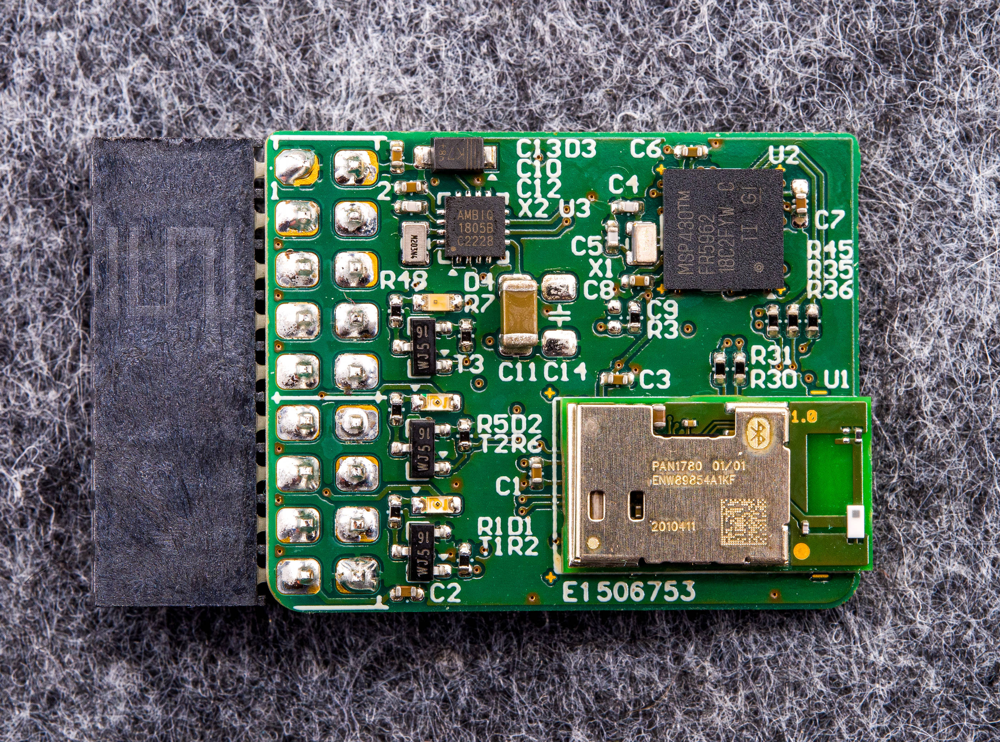

# Target Boards & Firmware

**Documentation**: <https://orgua.github.io/shepherd/external/shepherd_targets.html>

**Source Code**: <https://github.com/orgua/shepherd-targets>

**Main Project**: <https://github.com/orgua/shepherd>

---

The repository contains a collection of target-hardware and mcu-firmwares used by the shepherd-testbed. In the past shepherd had a nRF52-only target but can now leverage an additional FRAM, as demonstrated successfully by the 
[Riotee-Platform](https://www.riotee.nessie-circuits.de).

**NOTE**: The shepherd testbed has a second target-port (unused) and is looking for ideas. Just contact us.

## nRF52 with MSP430FR as FRAM

Hardware v1.0 uses

- nRF52840 (Panasonic PAN1780)
- MSP430FR5962 (TI)
- RTC

BOM, gerber-files and schematics are available in the [PCB-Directory](https://github.com/orgua/shepherd-targets/tree/main/hardware). This folder also contains a guide for testing new target-PCBs.

### Features

- freedom to use both MCUs as needed (just as radio or FRAM) or disable when not needed (deep sleep)
- over-voltage protection for V_LV (max 3.9V)
- two debug LEDs with external supply (minimal impact on pwr-budget)
- one self-powered LED to "burn" energy
- io pins not interfering with RF (nRF PS v1.6 page 578)
- LEDs / UART similar to Riotee
- nRF uses low voltage mode (PSv1.1 page 61)

### nRF52-Firmwares

- [nrf52_demo_rf](https://github.com/orgua/shepherd-targets/tree/main/nrf52_demo_rf): demo implementation for a simple node that sends BLE packets when energy budget allows it
- [nrf52_testable](https://github.com/orgua/shepherd-targets/tree/main/nrf52_testable): watches all gpio and reports with UART messages (verification after assembly)
  - ensures that pcb is assembled OK and both MCUs are programmable and show basic functions
  - what is not tested: watchdog, FRAM, RF-Frontend (-> use rf-demo or rf-survey), sleep power consumption
- [nrf52_rf_test](https://github.com/orgua/shepherd-targets/tree/main/nrf52_rf_test): sends out 1 BLE-Packet per second (verify with an app like `RaMBLE`)
- [nrf52_rf_survey](https://github.com/orgua/shepherd-targets/tree/main/nrf52_rf_survey): Link Matrix Generator - TX-Unit - sends packet with every possible P_TX, loops until stopped
- [nrf52_deep_sleep](https://github.com/orgua/shepherd-targets/tree/main/nrf52_deep_sleep): practically turned off MCU with the lowest possible consumption

- TODO: nrf52_spi_radio - default implementation to use nRF as a radio frontend

### MSP430FR-Firmwares

- [msp430_deep_sleep](https://github.com/orgua/shepherd-targets/tree/main/msp430_deep_sleep): practically turned off MCU with the lowest possible consumption
- [msp430_spi_fram](https://github.com/orgua/shepherd-targets/tree/main/msp430_spi_fram): [riotee](https://github.com/NessieCircuits/Riotee_MSP430Fram) implementation to use MSP as a flash storage
- [msp430_testable](https://github.com/orgua/shepherd-targets/tree/main/msp430_testable): switches on all shared gpio one by one (verification after assembly)

- TODO: cleanup-fw - FRAM & program-storage should be wiped between runs

## Getting started

Step by step description for installing all prerequisites to compile the firmware.

### nRF52

- Make sure you have the [GNU Arm Embedded Toolchain](https://developer.arm.com/tools-and-software/open-source-software/developer-tools/gnu-toolchain/gnu-rm/downloads) installed
- If `arm-none-eabi-gcc` is not in your path, set the environment variable `GNU_INSTALL_ROOT` accordingly, e.g.: `export GNU_INSTALL_ROOT=/opt/toolchain/` (note the trailing foreslash)
- Download the nRF5 SDK from [here.](https://www.nordicsemi.com/Software-and-tools/Software/nRF5-SDK/Download) (You don't need a SoftDevice) and extract it
- Set the environment variables `SDK_ROOT` to the corresponding absolute path, e.g.: `export SDK_ROOT=/home/user/nRF5_SDK_17.0.2_d674dde/`
- run `make`

Refer to [the GitHub workflow](https://github.com/orgua/shepherd-targets/tree/main/.github/workflows/build_nrf.yml) for how to install the toolchain and build the project.

### MSP430

To build the code, you'll need the gcc toolchain for the MSP430 microcontroller series. Refer to [the GitHub workflow](https://github.com/orgua/shepherd-targets/tree/main/.github/workflows/build_msp.yml) for how to install the toolchain and build the project.

### Controlling the Node-ID

When an elf-firmware contains a ``SHEPHERD_NODE_ID`` the variable will patched with the actual target-ID before running the experiment. See the proposed [c-file](https://github.com/orgua/shepherd-targets/tree/main/nrf52_demo_rf/src/shepherd_node_id.c) for more information.
