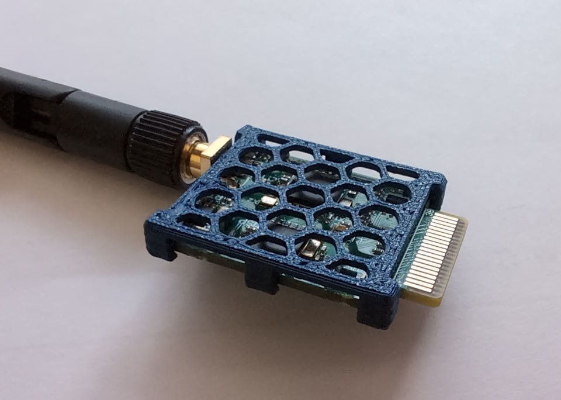

## Cage for Target

This is a printable cage that protect the sensitive electronics. 
Biofilm could add a resistive layer on the PCB that increases power-consumption of the target.

Printing was tested top-down with PLA. Support for the overhang can be added, but it also worked fine without it.

